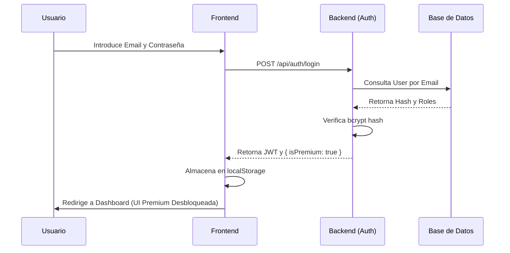
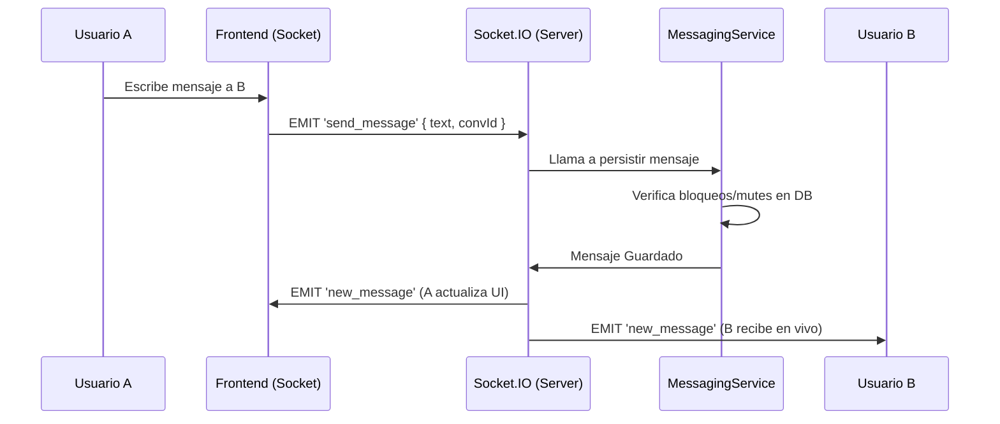
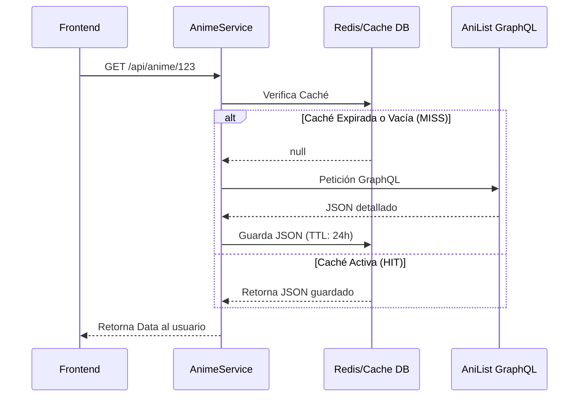
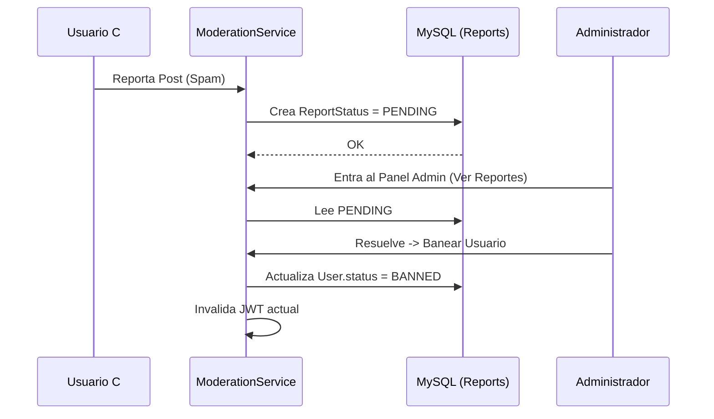
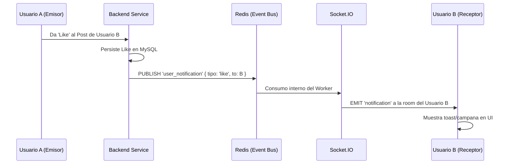

# Arquitectura Enterprise: AniNexo (Wikipedia & Social Network)

Este documento define la arquitectura técnica detallada y exhaustiva para AniNexo, una plataforma híbrida que combina una enciclopedia de anime (Wikipedia) con una red social integrada, garantizando escalabilidad, modularidad y separación de responsabilidades para un entorno Enterprise preparado para millones de usuarios.

## 1. Estructura de Carpetas y Módulos

### 1.1 Estructura Backend (Node.js / Express / Prisma)
```text
server/
├── prisma/               
│   └── schema.prisma     # Definición de Base de Datos y migraciones (Modelos Enterprise)
├── src/
│   ├── index.ts          # Punto de entrada (Setup Express, HTTP Server)
│   ├── sockets.ts        # Servidor WebSockets (Socket.IO)
│   ├── lib/              
│   │   ├── prisma.ts     # Cliente singleton Prisma (Conexión persistente MySQL)
│   │   └── redis.ts      # Cliente Redis (Gestión de Caché y Pub/Sub)
│   ├── middleware/       
│   │   ├── auth.ts       # Verificación JWT
│   │   ├── role.ts       # RBAC (Role-Based Access Control)
│   │   └── error.ts      # Manejador centralizado de excepciones
│   └── modules/          # Arquitectura basada en dominios (DDD)
│       ├── auth/         # Autenticación, JWT, Hash de contraseñas
│       ├── anime/        # Proxies e integración con AniList GraphQL
│       ├── profile/      # Perfiles públicos, biografía, contadores
│       ├── list/         # Listas de seguimiento (Viendo, Completado, Score)
│       ├── feed/         # Timeline, Posts, y Algoritmos de ordenamiento
│       ├── social/       # Interacciones (Likes polimórficos, Follows)
│       ├── messaging/    # Chats 1a1, persistencia de mensajes
│       ├── moderation/   # Reportes, Mutes (Shadowban local), Bans
│       ├── admin/        # Configuración global, panel de control
│       └── nexo/         # IA (OpenAI), orquestación de system prompts
```

### 1.2 Estructura Frontend (Next.js 15)
```text
client/
├── src/
│   ├── app/              # App Router (Next.js)
│   │   ├── (auth)/       # Rutas públicas (Login, Register)
│   │   ├── dashboard/    # Rutas privadas protegidas (Feed, Perfil, Listas)
│   │   ├── admin/        # Rutas exclusivas (Panel de Moderación y Analytics)
│   │   └── layout.tsx    # Layout raíz (Providers de Contexto y Temas)
│   ├── components/
│   │   ├── ui/           # Sistema de Diseño Base (Botones, Inputs, Cards, Modales)
│   │   ├── feed/         # Componentes específicos del muro social
│   │   ├── list/         # Cuadrículas de anime y controles de filtrado
│   │   ├── nexo/         # Interfaz flotante/lateral exclusiva del asistente IA
│   │   └── layout/       # Sidebars de navegación dinámica
│   ├── hooks/            # Custom Hooks (useAuth, useSocket, useIntersectionObserver)
│   ├── lib/              # Utilidades, Fetchers (Axios/Fetch wrappers), Socket Client
│   ├── store/            # Estado global del cliente (Zustand)
│   └── styles/           # Sistema de Diseño CSS genérico y Tokens de diseño
```

## 2. Separación de Responsabilidades y Flujos de Datos

La arquitectura sigue un patrón estricto MVC y DDD (Domain-Driven Design):
- **Capa de Presentación (Frontend):** React/Next.js se encarga de renderizar la enciclopedia (Wikipedia), el estado social, reaccionar a WebSockets y capturar interacciones. No almacena lógica de negocio.
- **Capa de Enrutamiento y Control (Backend - Controllers):** Valida los *payloads* HTTP, maneja códigos de estado HTTP y delega el trabajo pesado.
- **Capa de Negocio (Backend - Services):** Contiene el 100% de la lógica (ej. Validar si un usuario puede dar like, procesar IA, emitir eventos a Redis/Socket).
- **Capa de Persistencia (Base de Datos):** MySQL actúa como única fuente de la verdad para datos relacionales (Prisma). Redis actúa como sistema de eventos y caché en memoria.

## 3. Arquitecturas Específicas

### 3.1 Arquitectura de Tiempo Real y Sistema de Eventos
El sistema en tiempo real usa **Socket.IO**.
- El servidor inicializa una conexión y los usuarios se unen a "Rooms" (ej. `room_userId`, `room_conversationId`).
- **Event Bus (Pub/Sub):** En un futuro escalado, se usa Redis Pub/Sub para que múltiples instancias de Node.js puedan emitir eventos de WebSocket a usuarios conectados en otros servidores.

### 3.2 Arquitectura Nexo (Asistente IA)
Nexo funciona como una capa inteligente que interviene en el frontend.
- **Contexto de Inyección:** Nexo recibe la ruta en la que está el usuario y la información del anime en pantalla.
- **Diferenciación de Roles:** Si el usuario es `PREMIUM`, Nexo usa un *System Prompt* elegante, prolijo, y un límite alto de tokens. Si es `USER`, Nexo usa un prompt sarcástico ("tsundere") limitando los tokens para ahorrar costos de API.

### 3.3 Integración AniList y Sistema Caché
Dado que AniList limita las peticiones (rate limiting), el backend actúa como un Proxy inverso con Caché.
- Toda petición a AniList pasa por `AnimeService`.
- Se revisa Redis/MySQL temporal para ver si el ID del anime ya fue consultado en las últimas 24 horas. Si es así (Cache HIT), se ahorra la petición.

### 3.4 Sistema de Moderación y Panel Admin
La moderación es asíncrona.
- Usuarios envían reportes.
- El Panel Admin (Ruta Frontend `/admin` protegida por `role === 'ADMIN'`) consolida reportes.
- El Admin ejecuta una sanción. Si es `MUTE`, el middleware de Sockets intercepta y bloquea silenciosamente cualquier mensaje del usuario. Si es `BAN`, el token JWT se añade a una *blacklist* de Redis.

### 3.5 Feature Flags y Mantenimiento
La base de datos contiene una tabla `SystemSettings`.
- La bandera `MAINTENANCE_MODE` puede activarse en tiempo real desde el Panel Admin.
- Un Middleware en Express verifica en Caché esta bandera. Si está activa, rechaza todas las peticiones con 503, excepto si el token JWT pertenece a un `SUPERADMIN`.

### 3.6 Sistema de Analytics
- Un proceso recurrente (Cron) o triggers SQL agrupan la creación de posts, registros y mensajes por día.
- Se almacenan en `AnalyticsSnapshot`.
- El frontend consume estos *snapshots* para generar gráficos de Chart.js en el Panel Admin.

---

## 4. Diagramas de Flujos Conceptuales Completos

### 4.1 Flujo de Autenticación y Premium


### 4.2 Flujo de Mensajería (Chat)


### 4.3 Flujo de Sincronización y Caché (AniList)


### 4.4 Flujo de Reportes y Moderación


### 4.5 Flujo de Notificaciones (Event System)


### 4.6 Flujo de Recomendaciones de IA
```mermaid
flowchart TD
    A[Usuario navega Perfil] --> B[Frontend pide Recomendación a Nexo]
    B --> C[Backend carga Lista de Animes del Usuario]
    C --> D[Construcción del Prompt Contextual]
    D --> E{Es Premium?}
    E -->|Sí| F[Prompt Detallado + Análisis Psicológico de gustos]
    E -->|No| G[Prompt Estándar de 2 líneas]
    F --> H[OpenAI API]
    G --> H
    H --> I[Devuelve 3 Animes Similares]
    I --> J[UI Muestra "Nexo Recomienda..."]
```

---
## 5. Mandato de Integridad de Datos

Para asegurar que AniNexo mantenga su robustez Enterprise, se establece la siguiente regla de oro:

> [!IMPORTANT]
> **Conectividad Total:** Todo cambio o nueva funcionalidad que se integre en la plataforma debe estar obligatoriamente conectado a la base de datos (MySQL/Prisma). No se permiten estados volátiles o placeholders en componentes críticos.
>
> **Sincronización de Esquema:** Cualquier modificación en la lógica de negocio que requiera nuevos datos debe verse reflejada inmediatamente en el `schema.prisma`, ejecutando las migraciones o actualizaciones necesarias (`db push`) para mantener la coherencia entre el código y la persistencia.

---
*Documento Arquitectónico Enterprise Finalizado - Listo para auditoría y ejecución.*
